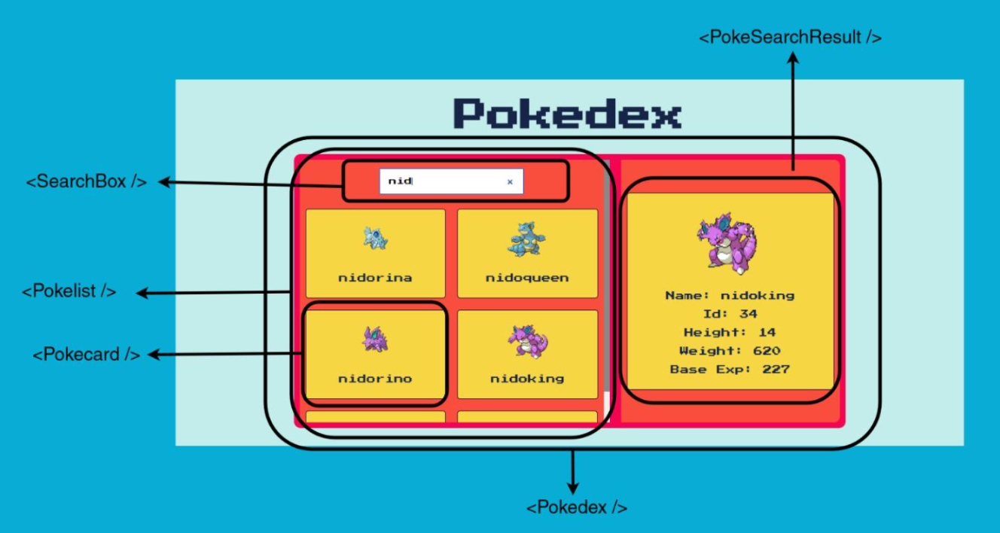

# Pokedex Types

A simple pokedex application made with React + TS

## Component Architecture

## Phases of development

1. Static designs
2. Integrating the Schemas/Types
3. Making the pokelist functional
4. Making the searchbox functional 
5. Selecting pokemon should work.